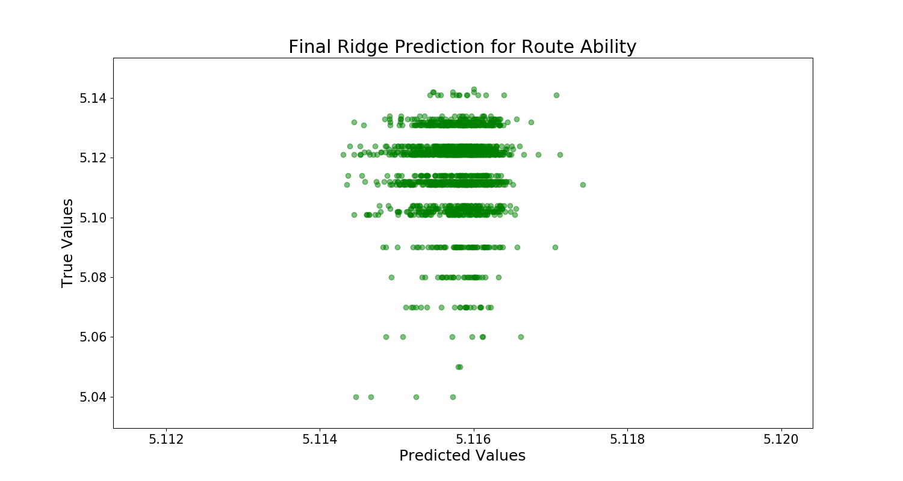
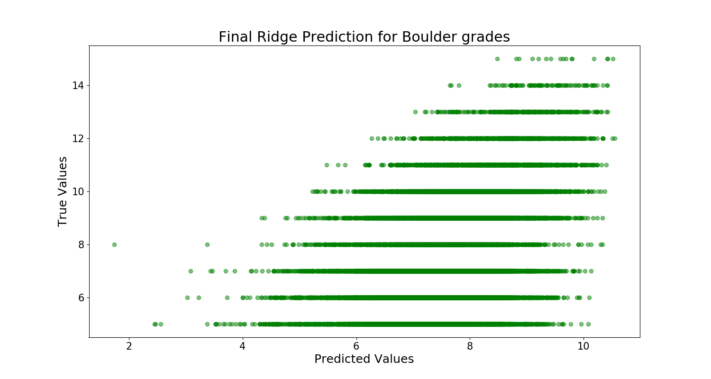

# Analyzing a Climbing Logbook

### Motivation and Background

As an avid climber, common questions we all have are:  
How does my height/weight/age affect how hard I can climb?  
Is this different for routes vs boulders?  
How long will it take me to progress to a certain level?  
Is this route/boulder graded correctly?

As such, I've set out to see if I can answer some of these questions using data from climbers.

For the data, I'm only looking at routes graded 5.4 - 5.15a that were not a Top rope ascent and boulders graded V0 - V16 completed by climbers from the USA.

I have two ultimate goals:
1. Find a model that predicts the grade of a route/boulder.
2. Find a model that predicts how hard users climbed in 2017.

### Data Cleaning

This data comes from the site 8a.nu, where climbers can keep a log of which boulders and routes they have completed and when. The data came in the form of a sqlite database with 4 different tables: ascents, grades, methods and users. I converted the SQL tables to CSVs and then imported each to a `pandas` dataframe using the `import.py` script. The `clean_data.py`was used to clean the final `pandas` dataframe for use in EDA and modeling.

The importing and cleaning steps included:
* Merging the four dataframes into one.
* Removing users born outside of the United States.
* Dropping any rows with missing values in the birth, height, weight, usa_routes and usa_boulders columns.
* Removing deactivated users, users without a start date, route grades under 5.4, ascents labeled as Toprope.
* Dropping unwanted columns.
* Converting height and weight to inches and lbs, respectively.
* Converting birth and ascent_date to datetime format, and adding current_age and ascent_age columns.
* Adding a time_to_send column.
* Combining sponsor1, sponsor2, and sponsor3 into one sponsored columns with values 0 (not sponsored), 1 (sponsored).
* Splitting the dataframe into two: one for routes and one for boulders.

### EDA

  

  

  

  

  

#### Boulders
|Grade|Average ascent age|Grade|   Average ascent age
|-----|------------------|-----|------------------|
|V0|27.39 | V9 | 25.21|
|V1|26.12 | V10 | 24.59|
|V2|25.95| V11|24.18| 
| V3|25.73| V12|24.08|
| V4|25.64| V13|24.35|
| V5|25.56| V14|24.99|
| V6|25.76| V15|24.96|
| V7|25.46| V16|29.00|
| V8|26.30|

The overall average ascent age is 25.60.  

 #### Routes
|Grade|Average ascent age|Grade|   Average ascent age
|-----|------------------|-----|------------------|
|5.4|26.48| 5.12a|28.17|
|5.5|30.80| 5.12b|28.56|
|5.6|30.43| 5.12c|29.02| 
|5.7|27.82| 5.12d|28.85|
|5.8|28.26| 5.13a|28.47|
|5.9|28.45| 5.13b|28.17|
|5.10a|28.24| 5.13c|27.60|
|5.10b|28.36| 5.13d|26.78|
|5.10c|28.73| 5.14a|26.13|
|5.10d|28.73| 5.14b|25.14|
|5.11a|29.02| 5.14c|25.12|
|5.11b|29.21| 5.14d|25.25| 
|5.11d|29.14| 5.15a|25.70|

The overall average ascent age is 27.95.  

### Feature Engineering

Before modeling the data to predict the difficulty of a climb, I dropped any columns in the list below, since the column was either highly correlated with the grade (target column) or another column that remains in each dataframe.  

`['notes','climb_type','crag','sector','climb_country','method','birth','ascent_date','date','grade_id','climb_name','ascent_date_day','ascent_date_month','chipped']`

Similarly, I dropped these columns before modeling the data to predict how hard users climbed in 2017.

`['notes','climb_type','crag','sector','climb_country','method','birth','ascent_date','date','climb_name']`

### Modeling the Difficulty of a Climb

I chose to use Ridge and Lasso to fit a model to my data using the sklearn's `RidgeCV` and `LassoCV` with alphas = np.logspace(-2,4,num=250) and cv=10. I first split my data into training and testing with a test size = 0.25, then standardized the training data, employed either `RidgeCV` or `LassoCV`, and compared the R2 scores.

Using the model with the best R2 score (Ridge), I fit a Ridge model with the optimal alpha from my training sets to the unseen data and plotted the predicted values vs. the true values.

Final R2-score: 0.2789  
Final RMSE: 2.4600  

 

Final R2-score: 0.2667  
Final RMSE: 0.0133  
(The predicted range for route grades is 5.085 - 5.135) 

I used the lasso models to look at which coefficients were zeroed out to see which features affected the grade prediction the most.

|Route Coefficient|Coefficient label| Boulder Coefficient
|:-----|:------------------:|-----:|
|-0.420227| method_id | -0.341025|
|-0.160095 | current_age| -0.257434|
|-0.098043 | weight| **-0.088076**|
|-0.068357 | user_id |-0.168992|
|-0.056192 | sex| -0.110300|
|-0.044171 | ascent_age| -0.039622|
|-0.012482 | height| **0.017309**|
|-0.006193 | crag_id| **0.003741**|
| 0.000000 | year| 0.000000 |
| 0.000000 | sector_id| **-0.027723**|
| 0.000000 | started| **-0.000505**|
| 0.000000 | ascent_date_year| 0.000000|
| 0.000000 | sponsored| 0.000000|
| 0.094638 | rating| 0.112982 |
| 0.252175 | time_to_send| 0.284513| 

### Modeling How Hard Users Climbed in 2017

I followed the same process and code for modeling how hard users climbed in 2017 as with modeling the difficulty of a climb, with the added caveat that there were a limited number of rows with data for 2017. This forced the size of the feature matrix to shrink since a sample was taken from the full feature matrix to match the length of the target. 

Below are the results of the final models.

Final R2-score: -0.0020  
Final RMSE: 2.9644  

 

Final R2-score: -0.0032  
Final RMSE: 0.0134  

### Results - Why are these models not performing well?

For the difficulty of a climb model, I believe this model is not performing well due to the nature of the data. The highest influencer of the model are time it took a user to do the climb, but just because it took a user years to send a V4, say, that doesn't tell us much about how hard the boulder actually is (the user may not have tried that boulder before, he/she could have been warming up, etc.) In order to improve the model, we would need more data about the actual climbs, like the kind of holds on the climb (crimps, slopers, jugs, etc.) or the type of rock.

For the climbing abiltiy in 2017 model, due to the number of reported ascents in 2017, the data used to train/test was cut down  from 129,348 rows to < 7200 rows for boulders and from 115,391 rows to < 6500 for routes. The models shown were from only one sample of the total data for the years prior to 2017, so the model is heavily dependent on which rows were randomly chosen. In order to improve the model, I would need to fit the model to many samples and choose the one that performed the best.

### Improving the Grade Model?

Since the model for all grades was not fitting well, I decided to see if restricting my data to only boulder grades V5 and above and route grades 5.11a and above would help improve the model.

R2 score: **0.2073**  
RMSE: **1.8839**

R2 score: 0.2686  
RMSE: **0.0063**

### Future Work

In the future, I'd like to spend more time on the model for how hard users climbed in 2017. I believe looking at the hardest a user climbed in the previous years, rather than all of the climbs they did, would create a better model (since a user probably climbed a large range of grades, not just at his/her max each time he/she went climbing). 

### References

This data was downloaded from Kaggle, courtesy of David Cohen.
