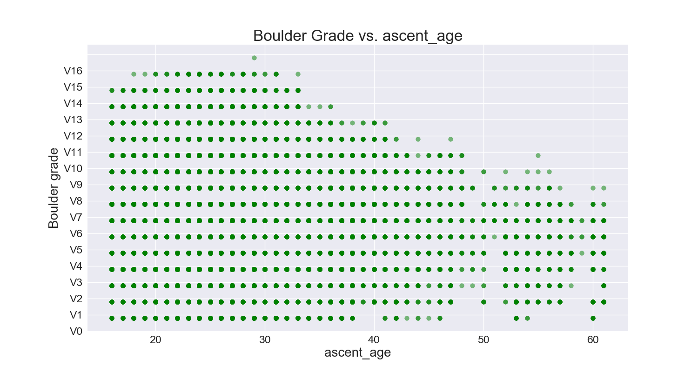
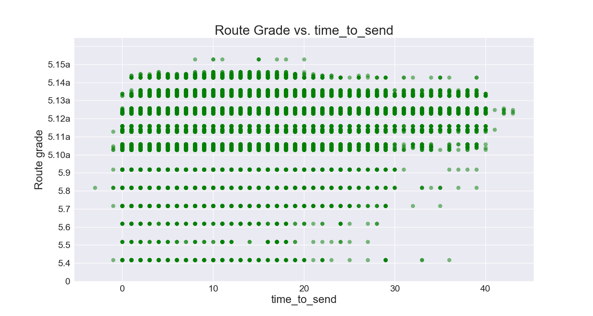

# Analyzing a Climbing Logbook

### Motivation and Background

As an avid climber, common questions we all have are:  
How does my height/weight/age affect how hard I can climb?  
Is this different for routes vs boulders?  
How long will it take me to progress to a certain level?  
Is this route/boulder graded correctly?

   
Left: V4, Right: Also V4??

As such, I've set out to see if I can answer some of these questions using data from climbers.

I have two ultimate goals:
1. Find a model that predicts which grade a route/boulder should have.
2. Find a model that predicts how hard a climber will climb in the next year.

### Datasource

This data comes from the site 8a.nu, where climbers can keep a log of which boulders and routes they have completed and when. This data was downloaded from Kaggle, courtesy of David Cohen.

### EDA

  

  

  

  

  

#### Boulders
|Grade|Average ascent age|Grade|   Average ascent age
|-----|------------------|-----|------------------|
|V0|27.39 | V9 | 25.21|
|V1|26.12 | V10 | 24.59|
|V2|25.95| V11|24.18| 
| V3|25.73| V12|24.08|
| V4|25.64| V13|24.35|
| V5|25.56| V14|24.99|
| V6|25.76| V15|24.96|
| V7|25.46| V16|29.00|
| V8|26.30|

The overall average ascent age is 25.60.  

 #### Routes
|Grade|Average ascent age|Grade|   Average ascent age
|-----|------------------|-----|------------------|
|5.4|26.48| 5.12a|28.17|
|5.5|30.80| 5.12b|28.56|
|5.6|30.43| 5.12c|29.02| 
|5.7|27.82| 5.12d|28.85|
|5.8|28.26| 5.13a|28.47|
|5.9|28.45| 5.13b|28.17|
|5.10a|28.24| 5.13c|27.60|
|5.10b|28.36| 5.13d|26.78|
|5.10c|28.73| 5.14a|26.13|
|5.10d|28.73| 5.14b|25.14|
|5.11a|29.02| 5.14c|25.12|
|5.11b|29.21| 5.14d|25.25| 
|5.11d|29.14| 5.15a|25.70|

The overall average ascent age is 27.95.  

### Feature Engineering

### Modeling

### Results

### Future Work

### References
