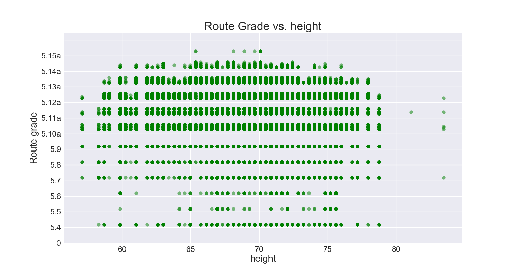

# Analyzing a Climbing Logbook

### Motivation and Background

As an avid climber, common questions we all have are:  
How does my height/weight/age affect how hard I can climb?  
Is this different for routes vs boulders?  
How long will it take me to progress to a certain level?  
Is this route/boulder graded correctly?

   
Left: V4, Right: Also V4??

As such, I've set out to see if I can answer some of these questions using data from climbers.

I have two ultimate goals:
1. Find a model that predicts which grade a route/boulder should have.
2. Find a model that predicts how hard a climber will climb in the next year.

### Datasource

This data comes from the site 8a.nu, where climbers can keep a log of which boulders and routes they have completed and when. This data was downloaded from Kaggle, courtesy of David Cohen.

### EDA

 

 

 

 

 

#### Boulders
|Grade|Average ascent age|Grade|   Average ascent age
|-----|------------------|-----|------------------|
|V0|28.42|V9|25.60|
|V1|26.43|V10|24.94|
|V2|26.28|V11|24.59| 
| V3|25.97|V12|24.48|
| V4|25.99|V13|24.67|
| V5|25.89|V14|25.28|
| V6|26.16|V15|25.22|
| V7|25.88|V16|29.00|
| V8|27.01|

The overall average ascent age is 25.99.  

 #### Routes
|Grade|Average ascent age|Grade|   Average ascent age
|-----|------------------|-----|------------------|
|5.4|28.16|5.12a|28.82|
|5.5|35.89|5.12b|29.21|
|5.6|34.55|5.12c|29.73| 
|5.7|28.93|5.12d|29.59|
|5.8|29.19|5.13a|29.21|
|5.9|29.48|5.13b|29.08|
|5.10a|29.04|5.13c|28.38|
|5.10b|29.19|5.13d|27.70|
|5.10c|29.44|5.14a|26.83|
|5.10d|29.40|5.14b|25.85|
|5.11a|29.57|5.14c|25.58|
|5.11b|29.80|5.14d|25.64| 
|5.11d|29.68|5.15a|26.30|

The overall average ascent age is 29.01.  

### Feature Engineering

### Modeling

### Results

### Future Work

### References
